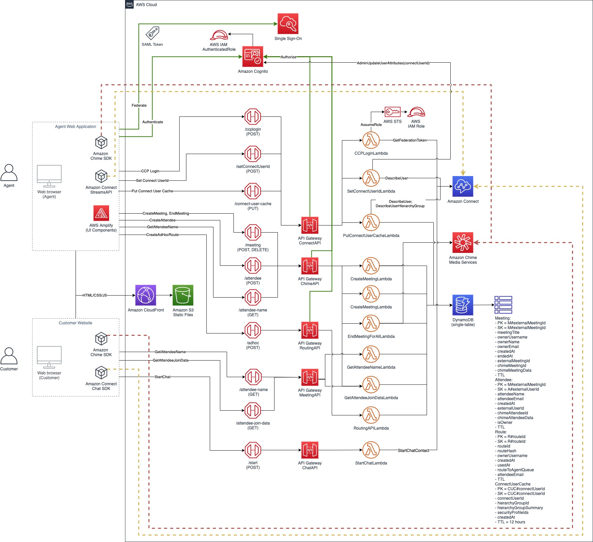
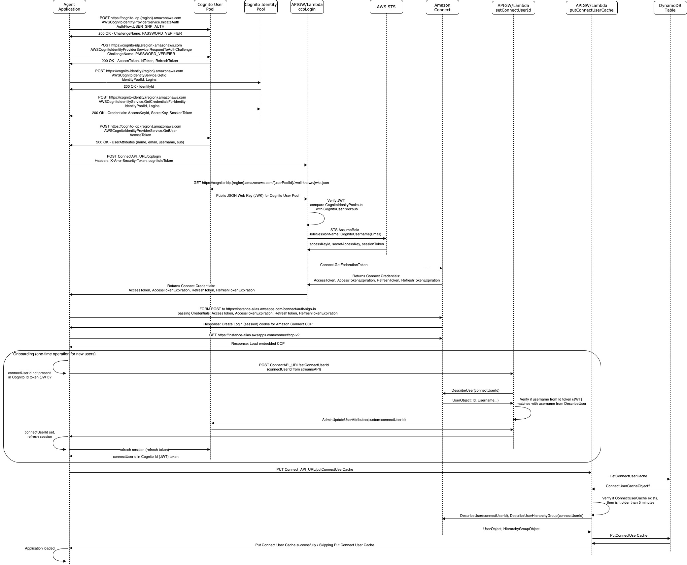
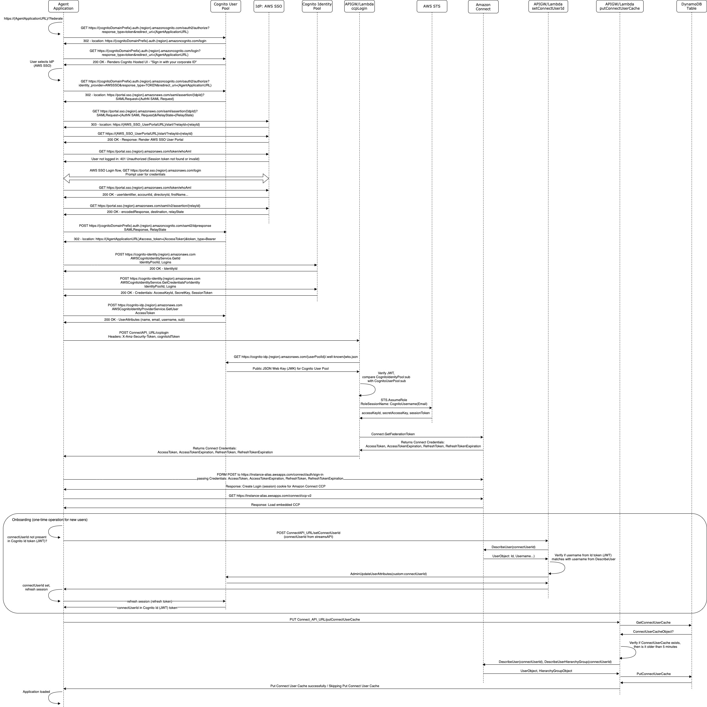
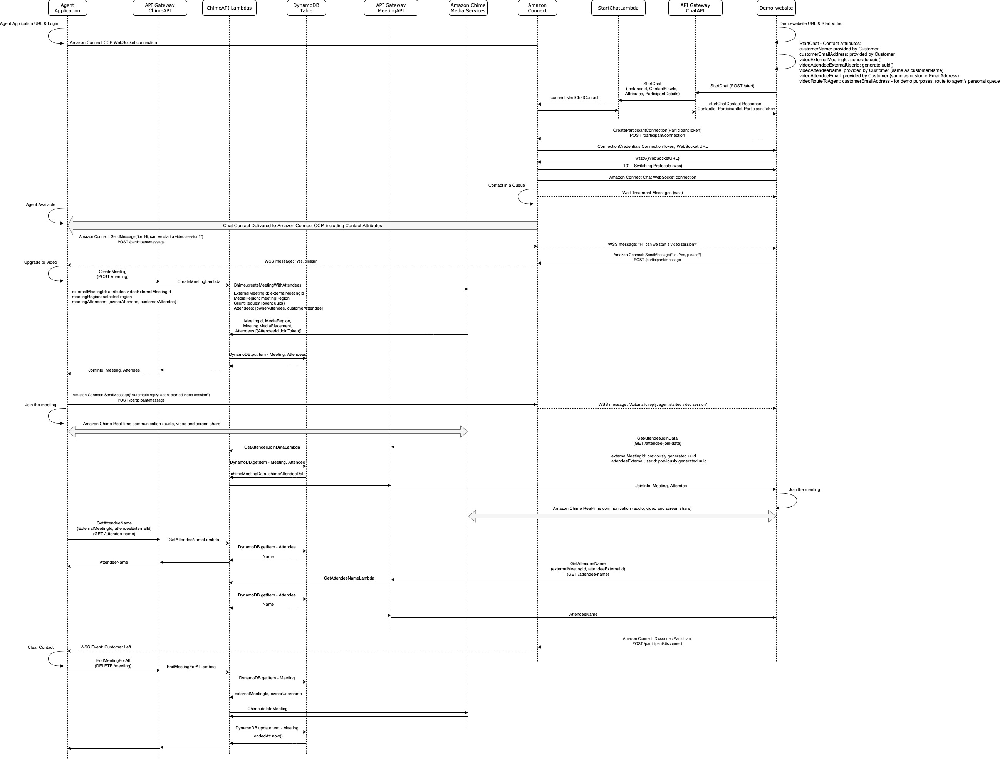
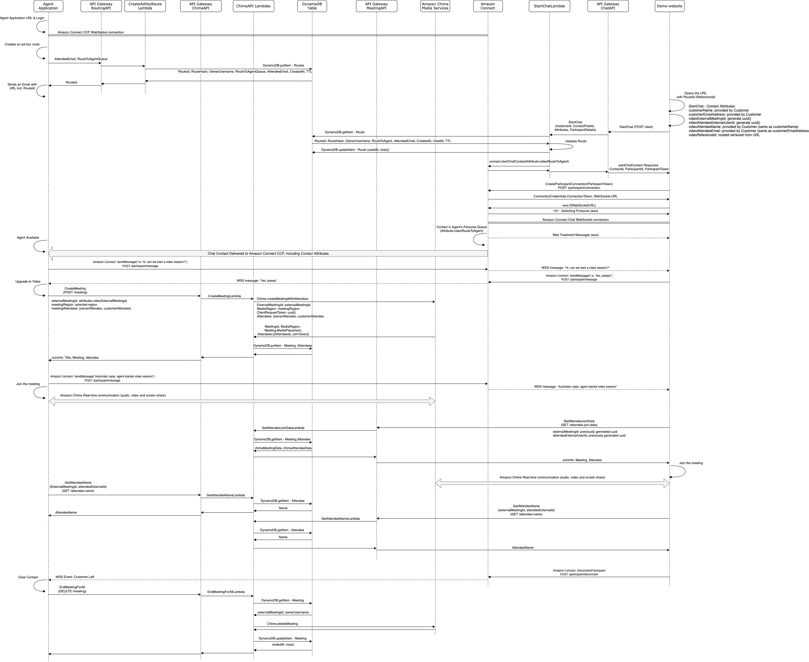

# Video Call Escalation - powered by Amazon Connect and Amazon Chime SDK

This solution deploys all the resources needed to enable Video Communication in a Contact Centre environment.

For this purpose, we are using Amazon Connect, which is an easy to use omni-channel contact centre service, and Amazon Chime SDK which a set of real-time communication components that developers can use to quickly add video and screen sharing capabilities to their web or mobile applications, with optional video call recording feature.

## Use-case scenario

As in most Contact Centre scenarios, we have a customer who has a need to contact a company, and we also have agents, who are trying to help their customers.

Typically, a customer would navigate to company webpage, browse and try to find an information, but they might need to get in touch with an agent, therefore on our demo page (demo-website) we have a button that would allow customers to easily initiate a video call. 

In our demo page, we ask customers for their name and email address, but if our customer was previously logged in into our website, we could collect customer details from their profile (not included in the demo-website).

Once the initial form is submitted with customer's details, we instantly start a chat, or we could say a text based conversation. There are multiple benefits of initiating chat communication in the first place:
* Chat is a very simple way of communication, and has less dependencies on customer's equipment, such as PC, laptop, their camera, speaker and microphone setup.
* The idea here is that we would establish chat, or text based communication, between the customer and our agent, so that agent can simply help customer with their settings, if needed.
* While customer is waiting for our agent, we can provide personalized and interactive experience to our customer. For instance, we can display a message based on the queue status, or even display a personalized message, by welcoming our customer by their first name, or even be proactive and try to predict why customer might be calling us, and so forth.
* At this stage, we can allow our customer to interact with a bot, which would allow us to better understand the customer intent, but also provide some guidance and even some web links to other areas of our website, based on customer interaction with the bot.
* Finally, as all AWS services are consumption based, we are not starting the actual video call before both customer and agent are ready, therefore there will be no Amazon Chime service charges while customers are waiting in the queue.

From the agent perspective, this solution provides a web-based application (agent-app), which allows agents to handle all channels, such as voice, chat and video, without any plugin installations, and basically using standard agent kit, such as standard PC or laptop, with a standard built-in or attached camera.

Once incoming chat contact is accepted, the agent can greet the customer, and offer them to upgrade their conversation into a video session (and/or screen share session). Video session (meeting) is only created by the agent, and as part of this solution, only the agent (the meeting owner) can add customer to the session (meeting). 

As soon as session is created, and customer is added as an attendee, the customer would get a pop-up dialog, allowing them to join the video session. In this solution, both agent and customer can select their input and output devices, but that could be customized, to be even more customer friendly, for instance simplifying the interaction flow if there was a single camera and microphone, or store the previous selection preferences and avoid the Device Selection pop-up for each session. The most important detail is that agent can talk with the customer, via chat, which allows agent to help customer to set their equipment properly, for the best video experience.

In this solution, both cameras are turned off by default, so that customer and agent can explicitly enable their video once they are comfortable to do that. Here, agent could have their camera enabled by default, while we could leave that as a manual action for our customer.

Once input and output devices are selected, customer and agent can talk on the video call, and they can share their screen as well. During the video session, we still have the chat channel opened, so agent and customer can share information through that channel as well. For instance, the agent can send a link to our customer, like Terms and Conditions, or an email address, or something similar. 

At the end, either agent or customer can disconnect the session, and agent would automatically become ready for their next call, or a chat.

To learn more about Video Call Recording Feature, please visit [Video Call Recording](/cdk-stacks/README.md#Video-Call-Recording)

This solution demonstrates one option for enabling video communication in Contact Centre, however AWS provides APIs and SDKs, as building blocks, so that our customers can develop both agent and customer experience that is most suitable fof them.

## Ad-Hoc Routes (voice to video escalation)

In the above use-case, the customer was already browsing through our website, before initiating the video call, but another very common use-case is when customers simply dial a well-known contact centre phone number and get connected to one of the available agents, then at some point during the conversation, the agent might decide that, in order to help the customer, it might be better to switch their conversation to video and/or screen-sharing session.  

In this scenario, we want to enable agents to quickly switch from a standard voice call to a video and/or screen-sharing session with the customer, then continue their conversation without any interruptions.

For this use-case, we need a standard, either existing or a new Contact Flow for voice contacts, and a phone number ([DID or Toll Free](https://docs.aws.amazon.com/connect/latest/adminguide/contact-center-phone-number.html)) assigned to the Contact Flow. For the demo purposes, we can use one of the included [default](https://docs.aws.amazon.com/connect/latest/adminguide/contact-flow-default.html) contact flows, for instance `Sample queue customer`.  

The customer journey starts with placing an inbound call to Amazon Connect phone number, and getting into a queue, after a welcome message, then waiting for an available agent. Once the incoming call is accepted on the agent side, the agent would start a regular conversation with the customer, and at some point, offer them to upgrade their conversation into a video and/or screen-sharing session.  

To start the transition process from voice to video, the agent clicks on `Create Ad-Hoc` button, to create an ad-hoc route (also known as routing reference, or just reference) for the customer. In the pop-up dialog, agent provides customer's email address and clicks on the `Create` button. This operation creates the route and displays the route ID (reference ID) on the agent screen, as well as link (URL) with the reference included, which customer could use to easily initiate the video call with a single click.

At this point, agent can either read (dictate) the reference (8 digits) number to the customer, as they are already on the voice call, or click on the customer's email address to open the default email editor on agent's computer, and send the link via email. This experience could be further extended to enable agent to send a text message, by integrating with Amazon Simple Notification Service, which is currently not part of the solution.  

The agent would then guide the customer to open the webpage, if not already on it, and enter the reference number, together with their name and email address.  
In case agent has sent the link (URL) via email, customer could simply click on the link, provide their name, and instantly initiate the video call.

The provided reference number is then validated, in combination with customer's email address, and in case the provided reference was valid, the customer would be routed to agent's personal queue, with `Priority 1`, which is the top priority. This routing strategy ensures that customer is routed straight to the agent, since the default priority for regular new contacts is 5.  
The reference is valid for 15 minutes (configurable), from the moment it was created by the agent, and immediately marked as `used` as soon as customer use it to start the contact.  

To deliver the contact to the agent, we still use chat channel, preserving all the benefits of having the text-based communication alongside video and/or screen-share, such as the ability to send an email address, web links to other parts of the website, or Terms and Conditions, share documents, as well as enabling agents to help customers with their device settings for video session.  

As soon as customer has been placed in agent's personal queue, with the top priority, the agent can advise customer that the original voice call would be terminated, in favour of the incoming chat contact. Agent then clicks on the `End Call` button on their CCP, and the chat contact is instantly delivered to the agent application.  

From this point, the agent would take the same steps as described previously: click on the `Start` button to start the video and/or screen-sharing session, and ask the customer to click on the `Join` button on their side. Customer and agent can turn on their cameras, and/or share their screens, once they are comfortable to do that.

## Solution components

On a high-level, the solution consists of 4 components, each contained in a separate folder:

* agent-app - web based (React) agent application, including Amazon Connect StreamsAPI and Amazon Chime SDK
* demo-website - a demo web page for customers, including Amazon Connect Chat SDK and Amazon Chime SDK
* ConnectContactFlows - a folder with demo Amazon Connect Contact Flows for chat routing and queueing
* cdk-stacks - AWS CDK stacks: 
    - `cdk-backend-stack` with all the backend resources needed for the solution (AWS Lambda, Amazon API Gateway, Amazon Cognito etc)
    - `cdk-front-end-stack` with front-end resources for hosting both agent-app and demo-website (Amazon S3, Amazon CloudFront distribution)


Solution architecture:  


## Solution prerequisites
* AWS Account
* AWS IAM user with Administrator permissions
* Amazon Connect instance (SSO/SAML enabled)
* Node (v14) and NPM (v8.5) installed and configured on your computer
* AWS CLI (v2) installed and configured on your computer
* AWS CDK (v1.150) installed and configured on your computer
* Recording stack requires **Docker** to be installed on your computer, to pull, build and publish a docker image to Amazon ECR (Elastic Container Registry).


## Solution setup

You can deploy the solution using AWS CDK CLI, but also using AWS CDK Pipelines (please check [Deploying with AWS CDK Pipelines](/cdk-stacks/README.md#Deploying-with-AWS-CDK-Pipelines)).
This step assumes you have completed all the prerequisites, and you have an existing Amazon Connect instance, SSO/SAML enabled.

1. Clone the solution to your computer (using `git clone`)

2. Import Amazon Connect Contact Flows
    - Login into your Amazon Connect console, as Admin
    - From the main menu, select Routing -> Contact Flows
    - Click the drop-down button next to Create contact flow, and select Create customer queue flow
    - Click the drop-down button next to Save, and select Import flow
    - Browse to solution's ConnectContactFlows folder and select VideoCallEscalationQueue file
    - Save and Publish the contact flow
    - Navigate again to Routing -> Contact Flows
    - Click Create contact flow button
    - Click the drop-down button next to Save, and select Import flow
    - Browse to solution's ConnectContactFlows folder and select VideoCallEscalationChat file
    - Save and Publish the contact flow

3. Check AWS CLI
    - AWS CDK will use AWS CLI local credentials and region
    - check your AWS CLI configuration by running an AWS CLI command (i.e. `aws s3 ls`)
    - you can also use profiles (i.e. `export AWS_PROFILE=yourProfile`)
    - you can confirm the configured region with  
     `aws ec2 describe-availability-zones --output text --query 'AvailabilityZones[0].[RegionName]'`

4. Install NPM packages 
    - Open your Terminal and navigate to `video-call-escalation/cdk-stacks`
    - Run `npm run install:all`
    - This script goes through all packages of the solution and installs necessary modules (agent-app, demo-website, cdk-stacks, lambdas)

5. Configure CDK stacks
    - In your terminal, navigate to `video-call-escalation/cdk-stacks`
    - To see the full instructions for the configuration script, run  
    `node configure.js -h`
    - For the purpose of this guide, start the configuration script in interactive mode   
    `node configure.js -i`
    - (You can configure it via single command, by directly providing parameters, as described in the script help instructions)
    - When prompted, provide the following parameters:
        - `connect-instance-arn`: Amazon Connect instance ARN that solution will use. For example: arn:aws:connect:{region}:111111111111:instance/aaaaaaaa-bbbb-cccc-dddd-eeeeeeeeeeee
        - `connect-instance-url`: Amazon Connect instance URL that solution will use. For example: https://connect-instance-alias.my.connect.aws (or https://connect-instance-alias.awsapps.com)
        - `connect-default-contact-flow-id`: Amazon Connect Contact Flow Id for the Contact Flow to be started when a new Chat contact is initiated (VideoCallEscalationChat Flow Id). For example: aaaaaaaa-bbbb-cccc-dddd-eeeeeeeeeeee
        - `cognito-domain-prefix`: Amazon Cognito hosted UI domain prefix, where users will be redirected during the login process. The domain prefix has to be unique, and you could put your Amazon Connect Instance Alias to it. For example: video-call-escalation-connect-instance-alias
        - `agent-api-allowed-origins`: Allowed Origins for agent-side APIs, please keep * at this point, we will come back to it once our front-end is deployed.
        - `website-api-allowed-origins`: Allowed Origins for (demo-)website-side APIs, please keep * at this point, we will come back to it once our front-end is deployed.
        - `website-ad-hoc-route-base-url`: Base URL for ad-hoc routes. For demo purposes, agent-app and demo-website have the same host (CloudFront), hence you can leave this parameter empty.
        - `cognito-saml-enabled`: as a starting point, set this parameter to `false`
        - `cdk-pipeline-enabled`: for Stack based deployment, set this parameter to `false`
        - `deploy-recording-stack`: If you want to enable video call recording, set to true. Otherwise, set to false. To learn more about Video Call Recording Feature and Video Call Recording configuration parameters, please visit [Video Call Recording](/cdk-stacks/README.md#Video-Call-Recording)
    - The script stores the deployment parameters to AWS System Manager Parameter Store

6. Deploy CDK stacks
    - In your terminal, navigate to `video-call-escalation/cdk-stacks`
    - Run the script: `npm run build:frontend`
    - This script builds frontend applications (agent-app, demo-website)
    - In case you started with a new environment, please bootstrap CDK: `cdk bootstrap`
    - Run the script: `npm run cdk:deploy`
    - This script deploys CDK stacks
    - Wait for all resources to be provisioned before continuing to the next step
    - AWS CDK output will be provided in your Terminal (Amazon Cognito User Pool Id, Amazon CloudFront Distribution URL)
    

7. Configure Amazon Connect Approved Origins
    - Login into your AWS Console
    - Navigate to Amazon Connect -> Your instance alias -> Approved origins
    - Click + Add origin

8. Configure API Allowed Origins (optional)
     - Cross-origin resource sharing (CORS) is a browser security feature that restricts cross-origin HTTP requests that are initiated from scripts running in the browser. At this point, we can restrict our APIs to be accessible only from our Amazon CloudFront Distribution domain (origin).
     - In your terminal, navigate to `video-call-escalation/cdk-stacks`
     - Start the configuration script in interactive mode, with additional -l (`load`) parameter  
     `node configure.js -i -l`
     - The script loads all the existing parameters, and prompts for new parameters to be provided
     - Accept all the existing parameters, but provide new values for:
         - agent-api-allowed-origins: Domain of your agent application, in this case Amazon CloudFront Distribution URL. For instance: `https://aaaabbbbcccc.cloudfront.net`
         - website-api-allowed-origins: Domain of your (demo-)website application, in this case Amazon CloudFront Distribution URL. For instance: `https://aaaabbbbcccc.cloudfront.net`
     - For the demo purpose, both agent-app and demo-website are hosted at the same Amazon CloudFront Distribution, but these would, most probably, be different in your production environment. 
     - The script stores the deployment parameters to AWS System Manager Parameter Store
     - While in `video-call-escalation/cdk-stacks`, run the deploy script: `npm run cdk:deploy`
     - Wait for the CDK stacks to be updated

9. Create a test agent (user)
     - To create an Amazon Cognito user, you'll need Cognito User Pool Id (created in step 5 - check for the AWS CDK Output, or check it in your AWS Console > Cognito User Pools)
     - Create an Amazon Cognito user by executing:  
     `aws cognito-idp admin-create-user --region yourDesiredRegion --user-pool-id yourUserPoolId  --username yourEmailAddress --user-attributes Name=name,Value=YourName`
     - You will receive an email, with a temporary password, which you will need in the next step
     - To create an Amazon Connect user, login into your Amazon Connect Console, select Users -> User management from the main menu
     - Click Add new users button, then click Next
     - Provide First name, Last name
     - Set Login name as your email address (as you have set when creating Cognito user)
     - Set Routing Profile (i.e. Basic Routing Profile)
     - Set Security Profile (i.e. Agent)
     - Click Save, then Create users
     - Note: Amazon Cognito accepts + in the email (username), for instance when using a single email address for multiple users, while Amazon Connect UI doesn't support + in the username. Therefore, create Amazon Cognito user with +, but in Amazon Connect, replace + with _

10. Test the solution
     - Open your browser and navigate to Amazon CloudFront Distribution URL. 
     - On the Login screen, provide your email address and temporary password you received via email
     - In the demo solution, you will be asked to confirm your email address - select Email and wait for the confirmation code to be delivered, then enter the confirmation code in the form and submit
     - At this point, the agent is logged in, and you could see Amazon Connect CCP on the left-hand side, and Amazon Chime meeting form on the right-hand side (Note: this may take a few moments to load. If the screen is not fully loading please try this in another browser to verify, it may be that the version or settings of your browser are blocking some things.)
     - In the top-right corner, click on 'Demo website' link (best to open it in a new, detached window)
     - On the demo-website, click "Video Call now" button, in bottom-right corner
     - When prompted, provide your name (as a customer name)
     - Provide your email address - please note, the demo Contact Flow (VideoCallEscalationChat) routes the chat contact to agent's personal queue (based on this email address)
     - Once customer is in queue, set your agent to Available state
     - Accept the incoming Chat contact
     - Exchange a couple of messages between agent and customer (i.e. asking customer about upgrading to video call)
     - On the agent side, in the Join Meeting form, click Start
     - This would trigger a device selection form, on both Agent and Customer side
     - Join the meeting on the agent side
     - Join the meeting on the customer side
     - Camera(s) are disabled by default, click the camera button on each side to enable
     - Test screen share (click on Content share button)
     - End chat on the customer side
     - Clear chat contact on the agent side
     - Agent is ready for a next contact


## Solution Authentication diagram (without SSO)

The following diagram displays Authentication flow for the solution, when SSO in not enabled. The diagram demonstrates how Amazon Cognito can be used as IdP service for Amazon Connect (CCP). Please note that Amazon Connect instance has to be SSO/SAML enabled.




## Enable SSO via SAML

The following diagram displays Authentication flow for the solution, when SSO is enabled. In this example, we are using AWS SSO as our IdP, but the flow would be similar for other popular IdPs. This is Service Provider Initiated (SP-Init) flow, where Amazon Cognito User Pool has a role of Service Provider (SP), and generates an AuthN SAML Request, which is then passed to AWS SSO (IdP). Upon user login, AWS SSO (IdP) generates SAML Response, which is then passed to Amazon Cognito User Pool. Finally, based on SAML Response, Amazon Cognito User Pool provides Access Token for the client application (agent-app).



Please follow these steps to enable AWS SSO for your deployment:

1. Configure AWS SSO
    - Login into your AWS Console
    - For not previously done, configure AWS SSO. Follow [Getting Started](https://docs.aws.amazon.com/singlesignon/latest/userguide/getting-started.html) to *Enable AWS SSO* and *Choose your identity source*
    - Navigate to AWS SSO -> Applications -> Add a new application
    - Select *Add a custom SAML 2.0 application*
    - Set *Display name* (i.e. VideoCallEscalation)
    - Set *Description* (i.e. VideoCallEscalation federation)
    - In the *AWS SSO metadata* section, please note the *AWS SSO metadata file* URL - copy this URL as we need it for the AWS CDK-Backend Stack configuration
    - In the *Application properties* section, set *Application start URL* as `https://{Amazon CloudFront Distribution URL}/?federate`
    - In the *AWS SSO metadata* section, click *If you don't have a metadata file, you can manually type your metadata values.*
    - Set *Application ACS URL* as `https://{cognitoDomainPrefix}.auth.{region}.amazoncognito.com/saml2/idpresponse`
    - Set *Application SAML audience* as `urn:amazon:cognito:sp:{cognitoUserPoolId}`
    - Click *Save changes* button
    - On the top od the page, select *Attribute mappings* tab
    - Populate the mappings as:  

    User attribute in the application | Maps to this value or user attribute in AWS SSO | Format
    --------------------------------- | ----------------------------------------------- | ------
    Subject | `${user:subject}` | persistent
    name | `${user:name}` | basic
    email | `${user:email}` | basic
    email_verified | `true` | basic
    ---  
    - Click *Save changes*
    - On the top of the page, select *Assigned users* tab and click *Assign users*
    - Select the Users and/or Groups that would have access to the application, and click *Assign users*

1. Configure an AWS IAM Role for ccpLoginLambda
    - This step is required in case your Amazon Connect users already use AWS SSO (or any other IdP) to login. As noted in the official *Configure SAML with IAM for Amazon Connect* documentation **Replacing this (*federation*) role causes previously federated users to fail at federation because it breaks existing user logins.** Therefore, to avoid the effort of re-creating all the existing users, we need to use the already existing federation role in our configuration. 
    - Login into your AWS Console 
    - For the next step, we need ccpLoginLambda role name, that was previously created by AWS CDK-Backend stack
    - Navigate to AWS Lambda -> select *ccpLoginLambda* -> select *Permissions* tab -> copy the *Execution role name*
    - Navigate to AWS IAM -> Roles
    - Find your existing federation role (for instance `AmazonConnectSSO`)
    - Click on the *Trust relationships* tab and then click *Edit trust relationship*
    - You should see an existing statement (one or more) that "Allow" your existing IdP to Assume this role
    - Append another statement as:  
    ```
    {
        "Effect": "Allow",
        "Action": "sts:AssumeRole",
        "Principal": {
            "AWS": "arn:aws:iam::{yourAccount}:role/{yourCcpLoginLambdaRoleName}"
        }
    }
    ```  
    - This new statement Allow our ccpLoginLambda to Assume the existing role, so existing Amazon Connect users could continue to login seamlessly
    - Please note the ARN of this existing role, as we are going to need it in the next step

1. Configure AWS CDK Stacks
    - In your Terminal, navigate to `video-call-escalation/cdk-stack`
    - Start the configuration script in interactive mode, with additional -l (load) parameter  
    `node configure.js -i -l`
    - Accept all the existing parameters, but to enable SSO:
    - Set cognito-saml-enabled parameter to `true`
    - Set the following SSO related parameters:
        - `ccpLogin-lambda-role-to-assume`: AWS IAM Role that will be assumed by ccpLoginLambda when connect.GetFederationToken is invoked. Set your existing AWS IAM role from the previous step (for example `arn:aws:iam::111111111111:role/AmazonConnectSSO`)
        - `cognito-saml-identity-provider-url`: *AWS SSO metadata file* URL that we copied before (for example `https://portal.sso.{region}.amazonaws.com/saml/metadata/aaabbbcccdddeee`)
        - `cognito-saml-identity-provider-name`: set the provider name, for example `AWSSSO`
        - `cognito-saml-callback-urls`: set as `https://{Amazon CloudFront Distribution URL}` (for example `https://aaaabbbbcccc.cloudfront.net`)
        - `cognito-saml-logout-urls`: set as `https://{Amazon CloudFront Distribution URL}/?logout` (for example `https://aaaabbbbcccc.cloudfront.net/?logout`)
    - The script stores updated deployment parameters to AWS System Manager Parameter Store
    - In your Terminal, navigate to `video-call-escalation/cdk-stacks`
    - Run script `npm run cdk:deploy`
    - Wait for build and deploy to complete

1. Test your configuration by logging in into your AWS SSO User Portal and clicking on the *VideoCallEscalation* application icon


## Detailed Video Call sequence



## Detailed Ad-Hoc Route sequence



## Clean up

To remove the solution from your account, please follow these steps:

1. Remove CDK Stacks
    - In your Terminal, navigate to `video-call-escalation/cdk-stacks`
    - Run `cdk destroy --all`

1. Remove deployment parameters from AWS System Manager Parameter Store
    - In your Terminal, navigate to `video-call-escalation/cdk-stacks`
    - Run `node configure.js -d`


