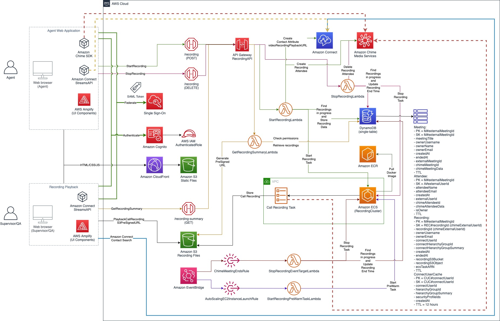

# AWS CDK stacks with all the backend and frontend resources

## Useful commands

 * `npm run install:all`                 install all necessary modules
 * `npm run build`                       compile typescript to js
 * `npm run configure`                   start the configuration script
 * `npm run sync-config`                 download frontend-config.js for local frontend testing (agent-app, demo-website)
 * `npm run build:frontend`              build frontend applications (agent-app, demo-website)
 * `npm run cdk:deploy`                  deploy backend and frontend stacks to your default AWS account/region
 * `npm run build:frontend:cdk:deploy`   build frontend applications and deploy stacks to your default AWS account/region

## Deploying with AWS CDK Pipelines

To simplify and automate the deployment, this solution supports AWS CDK Pipelines. 
AWS CDK Pipelines is a high-level construct library that makes it easy to set up a continuous deployment pipeline for AWS CDK applications.
More information in the official [AWS documentation](https://docs.aws.amazon.com/cdk/api/latest/docs/pipelines-readme.html).
By default, the pipeline is self-mutating, which means you only need to deploy cdk stacks one time, to get the pipeline started. 
After that, the pipeline automatically updates itself if you add new CDK applications or stages in the source code.

To deploy the solution with CDK Pipelines, please follow the steps: 

1. Complete the [Solution prerequisites](../README.md#Solution-prerequisites)
1. Clone the solution to your computer (using `git clone`)
1. Import Amazon Connect Contact Flows as described in [Solution setup](../README.md#Solution-setup)
1. Check AWS CLI as described in [Solution setup](../README.md#Solution-setup)
1. Install NPM packages as described in [Solution setup](../README.md#Solution-setup)

1. Configure CDK stacks
    - Set baseline parameters as described in **Configure CDK stacks** section of [Solution setup](../README.md#Solution-setup)
    - When prompted, provide the following parameters:
        - `cdk-pipeline-enabled`: set this parameter to `true` to enable CDK Pipeline based deployment
        - `cdk-pipeline-repository-name`: set the name of AWS CodeCommit Repository that CDK Pipelines fetches from. For instance `VideoCallEscalation`. This repository will be created as part of the pipeline.
        - `cdk-pipeline-repository-branch-name`: set the name of AWS CodeCommit Repository Branch that CDK Pipelines fetches from. For instance `main`
        - `cdk-pipeline-create-new-repository`: to create a new AWS CodeCommit Repository, set to `true`. To fetch from an existing AWS CodeCommit Repository, set to `false`
        - `cdk-pipeline-stage-name`: set the name of Stage in the CDK Pipelines. For instance, `Demo` or `Prod`
    - The script stores the deployment parameters to AWS System Manager Parameter Store

1. Deploy CDK Pipeline
    - In your terminal, navigate to `video-call-escalation/cdk-stacks`
    - Run the script: `npm run build:frontend`
    - This script builds frontend applications (agent-app, demo-website)
    - In case you started with a new environment, please bootstrap CDK: `cdk bootstrap`
    - Run the script: `npm run cdk:deploy`
    - This script deploys CDK Pipeline stack with the following resources:  
      `AWS CodeCommit Repository`, `AWS CodeCommit Repository User`, `AWS CDK Pipeline`,  
      with `CdkPipelineStage`, where `CdkPipelineStage` deploys `CdkBackendStack` and `CdkFrontendStack`
    - Wait for all resources to be provisioned before continuing to the next step

1. Generate credentials for AWS CodeCommit
    - The CDK Pipeline stack has provisioned an AWS CodeCommit Repository and a User for that repository, but the repository is empty at this point
    - You can use AWS CodeCommit as your primary repository, or you could setup a repository mirroring, to mirror all the updates from an external source into AWS CodeCommit
    - For the purpose of this guide, we are going to push the code directly into AWS CodeCommit repository
    - Login into your AWS Console
    - Navigate to IAM, then select `codecommit-user-{yourRepositoryName}` username
    - Select the Security credentials tab, and scroll to `HTTPS Git credentials for AWS CodeCommit` section
    - Click **Generate credentials** button
    - Please note: `This is the only time the password can be viewed or downloaded. You cannot recover it later. However, you can reset your password at any time.`
    - Save or download your credentials, and proceed to the next step

1. Configure Git remote and push the code to AWS CodeCommit
    - Login into your AWS Console and navigate to AWS CodeCommit
    - Find the repository name in the table, and click `HTTPS` in `Clone URL` column
    - The AWS CodeCommit Repository URL is stored in your clipboard
    - In your Terminal, navigate to `video-call-escalation`
    - To list current git remotes, run `git remote -v`
    - Typically, you would see `origin` and a URL pointing to the `origin` remote
    - At this point, you can `set-url` for `origin` to your AWS CodeCommit Repository URL, or you could create a new remote for your AWS CodeCommit Repository URL
    - For instance, to add a new remote, run `git remote add pipeline-demo {yourCodeCommitURL}`
    - Next time you run `git remote -v` you should be able to see two entries: `origin` and `pipeline-demo`
    - To push the code to AWS CodeCommit, assuming your `origin` branch is `master` and your `pipeline-demo` branch is `main`, you can run: `git push pipeline-demo master:main`
    - As soon as the code is pushed, the Pipeline checks out the code from AWS CodeCommit and deploys it
    - From this moment, any code pushed to `main` branch of AWS CodeCommit Repository, would start the Pipeline and deploy the updates, including the updates to Pipeline itself, since it's a self-mutating pipeline.

1. Continue with **Configure Amazon Connect Approved Origins** section of [Solution setup](../README.md#Solution-setup)
1. Optionally, complete **Configure API Allowed Origins** section of [Solution setup](../README.md#Solution-setup)
1. **Create a test agent (user)** as described in [Solution setup](../README.md#Solution-setup)
1. Finally, **Test the solution** as described in [Solution setup](../README.md#Solution-setup)

## Video Call Recording

Recording Stack adds **Video Call Recording** capability to Video Call Escalation solution, by using Amazon Chime SDK and Amazon Elastic Container Services. On a high level, it supports on-demand call recording start/stop, as well as automated recording start at the beginning of the call, and automated call recording stop at the end of the call. 

Automated and on-demand call recording features can easily be enabled by setting Amazon Connect Contact Attributes `videoRecordingAutoStartEnabled` and `videoRecordingStartStopEnabled` in your Contact Flows, similar as you would use `Set recording behavior` block for native Amazon Connect Voice and Chat recording. This provides a flexible way to enable call recording feature(s), based on your business logic and requirements. 

Recordings are stored in an Amazon S3 bucket that is created by the Recording Stack, and all recording objects are encrypted, by default using AWS-KMS master-key (SSE-KMS). Any user or application with the appropriate permissions can access the recordings in the Amazon S3 bucket, including Amazon Transcribe (and Amazon Comprehend), Amazon Rekognition, AWS Elemental MediaConvert and any other service for post-call audio and video processing. Video call recording retention policy can be enabled by using Amazon S3 file lifecycle, based on business and local law regulation requirements.

Supervisors and Quality Analysts can Search contacts through Amazon Connect Contact Search feature, in a same way as searching for voice and chat contacts, then use Video Call Recording playback link (`videoRecordingPlaybackURL`) contact attribute to playback the recording. Call recording playback access is based on user's Amazon Connect Security Profile, as well as user's Hierarchy Group, similar to Amazon Connect native voice call recording.

*Start call recording* request creates "a bot" (i.e. a headless meeting attendee in Amazon ECS Task) that joins an Amazon Chime SDK meeting session, and records meeting's **audio**, **video** and **screen share**, in high definition (1080p at 30fps by default, but configurable) and streams output to the specified Amazon S3 bucket. Once *Stop call recording* is requested, either by agent, or automatically at the end of the call, call recording upload is completed and "the bot" is removed from the meeting session (i.e. ECS Task is terminated).

**Solution architecture:**  

### Prerequisites
Recording stack is part of Video Call Escalation Backend stack, and cannot be deployed as a stand-alone stack. It can be deployed at the same time as the Backend stack, or it can be enabled latter, by setting `deployRecordingStack` configuration parameter. Recording stack supports both 'Stack' and 'Pipeline' deployment mode. 

Apart from general prerequisites listed for Video Call Escalation solution, Recording stack requires **Docker** to be installed on your computer, to pull, build and publish a docker image to Amazon ECR (Elastic Container Registry).

### Recording Stack overview

Recording stack includes the following components:
 - Main Recording stack (RecordingStack), defined in `recording-stack.ts`, with infrastructure resources such as Amazon VPC and Amazon ECS Cluster
 - Recording API stack (RecordingAPIStack), defined in `recordingAPI-stack.ts`, with API resources such as AWS Lambda and Amazon API Gateway
 - Chime EventBridge stack (CdkChimeEventBridgeStack), defined in `cdk-chime-event-bridge-stack.ts`, with resources such as Amazon EventBridge and target AWS Lambda function

The following describes all the resources deployed by the above stacks:  

1. **RecordingStack** is deployed as a nested stack of `CdkBackendStack` and contains the following resources:
    - **recordingVPC** - Amazon VPC (Virtual Private Cloud) with:
        - maxAzs: 2 - which means resources are distributed across 2 Availability Zones, in the desired AWS Region. This can be expanded, according to requirements, for instance to 3 Availability Zones
        - CIDR: `10.5.0.0/16` by default, but the CIDR can be modified according to network requirements, to avoid any overlap with existing VPCs
        - Subnets: by default, 2 private subnets and 2 public subnets are created, with `/24` network mask. Amazon EC2 instances, that are part of Amazon ECS Cluster, are created in private subnets, but these instance require network connectivity to Amazon Chime SDK media services, through public subnets and NAT gateways (which are automatically created by AWS CDK, for each subnet)
        - Depending on your capacity requirements, i.e. the number of concurrent calls to be recorded, you might need to expand the number of subnets accordingly
    - **recordingECSSecurityGroup** - a security group for Amazon ECS Cluster, with `allowAllOutbound: true`
    - **recordingECSCluster** - Amazon ECS Cluster for Recording Tasks, deployed in the VPC, with `containerInsights: true`
    - **recordingECSAutoScalingGroup** - Auto Scaling group defines a launch configuration that is needed to run the recording Amazon ECS Tasks, and enables scaling based on the current load.
        - `associatePublicIpAddress: false` - defines no EC2 instances should have public IP addresses assigned
        - For the demo purposes, `instanceType` is set to `c5.2xlarge`, with 8 vCPUs and 16 GiB memory, which is enough to host 2 Recording Tasks per instance. Based on your requirements, i.e. the number of concurrent calls to be recorded, you might need to select an instance type with higher capacity (more information: https://aws.amazon.com/ec2/instance-types/)
        - `minCapacity: 1` - as soon as solution is deployed, one Amazon EC2 instance would be launched, always ready to accept (launch) a new recoding Task when needed
        - `maxCapacity: 5` - for demo purposes, the maximum of 5 Amazon EC2 instances could be launched, which means up to 10 Recording Tasks (2 Recording Tasks per instance). You need to adjust this parameter based on the number of concurrent calls to be recorded. For instance, you can update the `instanceType` to support more Recording Tasks per Amazon EC2 instance, and accordingly set the maximum number (`maxCapacity`) that can be launched, at any given time.
    - **recordingECSCapacityProvider** - Amazon ECS Capacity Provider is used to manage the infrastructure that Recording Tasks use. A capacity provider requires an Auto Scaling group, in this case `recordingECSAutoScalingGroup` which defines the Amazon EC2 instance type, then `minCapacity` and `maxCapacity`.
        - `enableManagedScaling: true` - when managedScaling is enabled, Amazon ECS cluster manages scaling actions of Auto Scaling group, withing `minCapacity` and `maxCapacity` boundaries
        - `minimumScalingStepSize: 1` - The minimum number of container instances that Amazon ECS will scale in or scale out at one time.
        - `maximumScalingStepSize: 2` - The maximum number of container instances that Amazon ECS will scale in or scale out at one time. Depending on your capacity requirements, i.e. the number of concurrent calls to be recorded, you might need to increase `maximumScalingStepSize`, so more EC2 instances could be launched at one time.
        - `targetCapacityPercent: 60` - As soon as 60% utilization is reached, new EC2 instance(s) would be created, in steps between `minimumScalingStepSize` and `maximumScalingStepSize`, but up to `maxCapacity` of the `recordingECSAutoScalingGroup`. The specified value must be greater than 0 and less than or equal to 100. A value of 100 will result in the Amazon EC2 instances in `recordingECSAutoScalingGroup` being completely utilized.
    - **recordingDockerImage** - An asset that represents a Docker image. The image will be created during build time, and uploaded to an Amazon ECR repository.
        - `Dockerfile` (in `docker/recording` folder) specifies the image to be pulled: `FROM public.ecr.aws/lts/ubuntu:18.04_stable` and describes all the steps (install dependencies and copy operations) during the image build.
        -  `recording-task` folder contains `run.sh` script which is started at each new Recording Task start. 
            - `run.sh` script starts Mozilla Firefox browser, with a URL to `recording-app`, with Amazon Chime SDK meeting details (`CHIME_MEETING_DATA`, `CHIME_ATTENDEE_DATA`) in the query string parameters
            - `run.sh` then starts `record.js` script, which starts `ffmpeg` application (process) and streams the screen output to Amazon S3 bucket
        - `recording-app` is a web based application, with Amazon Chime SDK for JavaScript, and minimal set of UI elements to display all Amazon Chime SDK meeting participants. This web application is loaded in Mozilla Firefox browser, each time a new Recording Task starts.
        - Both `recording-task` and `recording-app` are installed (`npm install`) and build (`npm run build`) during the image build time (as defined in `Dockerfile`)
    - **recordingTaskDefinition** - A task definition is required to run Docker containers in Amazon ECS, and it specifies the Docker image to use with each container
        - `image` is set as `recordingDockerImage`
        - `cpu: 4096` - The minimum number of CPU units to reserve for the container. As instanceType was set to `c5.2xlarge`, which has capacity of 8192 CPU units, 2 recording Tasks can be created per EC2 instance.
        - `memoryLimitMiB: 8192` - The amount (in MiB) of memory to present to the Recording Task (container). 
    - **recordingBucket** - An Amazon S3 bucket to store the call recordings. Recordings are stored with `RECORDINGS/` prefix, followed by `year/month/day/hour`, with filename in format of `{chimeExternalMeetingId}-{chimeAttendeeExternalUserId}-{timestamp_UTC}.mp4`
    - **autoscalingEC2InstanceLaunchRule** - An Amazon EventBridge rule that triggers an AWS Lambda function (`startRecordingPreWarmTaskLambda`) each time `recordingECSAutoScalingGroup` adds a new Amazon EC2 instance to Amazon ECS Cluster (`recordingECSCluster`).
    - **startRecordingPreWarmTaskLambda** - AWS Lambda Lambda function triggered by `autoscalingEC2InstanceLaunchRule`. Each new Amazon EC2 instance pulls Docker image (`recordingDockerImage`) from Amazon ECR only when first Amazon ECS (Recording) Task is created, and since pulling the image takes ~30 seconds, this AWS Lambda function starts a Pre-Warm Task, so that image is already pulled when a new Recording Task is created. This significantly reduces the Recording Task start time on the new Amazon EC2 instance.  

1. **RecordingAPIStack** is deployed as a nested stack of `CdkBackendStack` and contains the following resources:  
    - **StartRecordingLambda** - AWS Lambda function that is invoked to start a new Recording Task
        - Permissions:
            - ReadWrite DynamoDB table
            - chime:CreateAttendee (Resources: `*`)
            - ecs:RunTask (Resources: `recordingTaskDefinitionARN`)
            - iam:PassRole (Resources: `recordingTaskDefinitionExecutionRoleARN`)
            - connect:UpdateContactAttributes (Resources: `{connectInstanceARN}/contact/*`)
        - AWS Lambda operations:
            - Read from DynamoDB, trying to find recordings in progress (recordings that don’t have `endedAt` value) - rejects new recording if one already in progress
            - Create Amazon Chime SDK Meeting Attendee as `recordingAttendeeName` parameter (`RECORDING` by default)
            - Get Attendee Join Data from DynamoDB - encoded and passed to `ECS.runTask`, so Mozilla Firefox browser can join the Amazon Chime SDK Meeting in the Recording Task (container)
            - Generate Recording filename, which is then passed to Recording Task
            - Create Amazon Connect Contact Attribute `videoRecordingPlaybackURL` (only for the first contact Recording Task)
            - Start ECS Recording Task, passing the following parameters: `TASK_TYPE`, `CHIME_MEETING_DATA`, `CHIME_ATTENDEE_DATA`, `RECORDING_BUCKET_NAME`, `RECORDING_FILE_NAME`, `RECORDING_SCREEN_WIDTH`, `RECORDING_SCREEN_HEIGHT`
            - Store recording data in DynamoDB, with `recordingId = chimeAttendeeExternalUserId`
    - **StopRecordingLambda** - AWS Lambda function that is invoked to stop a Recording Task
        - Permissions:
            - ReadWrite DynamoDB table
            - ecs:StopTask (Resources: `arn:aws:ecs:{region}:{account}:task/{recordingECSClusterName}/*`)
            - chime:DeleteAttendee (Resources: `*`)
        - AWS Lambda operations:
            - Read from DynamoDB, trying to find recordings in progress (recordings that don’t have `endedAt` value) - rejects stop recording if no recording in progress found
            - Stop ECS Recording Task, for each recording in progress (only one recording in progress is expected, but covering for any edge cases where more than one Recording Task is in progress)
            - Update DynamoDB recording data with `endedAt` timestamp
            - Delete Amazon Chime SDK Meeting Attendee
            - Return the number of `recordingsStopped` and `recordingsNotStopped`, so client (agent-app) can display a proper status for recording
    - **GetRecordingSummaryLambda** - AWS Lambda function that retrieves all recordings for provided `chimeExternalMeetingId`
        - Permissions:
            - Read DynamoDB table
            - s3:GetObject (Resources: `arn:aws:s3:::{recordingBucketName}/RECORDINGS/*`)
        - AWS Lambda operations:
            - Check for recording permissions, based on user's Amazon Connect Security Profile and Hierarchy Group
            - Generate an Amazon S3 pre-signed URL for each recording (that user has permission to access), with Expiry set to `recordingPresignedURLExpiresMinutes` parameter (default 15 minutes)
            - Returns a list of recordings (that user has permission to playback), together with Amazon S3 pre-signed URL for each recording
    - **RecordingAPI** - Amazon API Gateway HTTP API, with `authorizationType = 'AWS_IAM'`, and the following routes:
        - StartRecording - `POST` to `/recording` - mapped to `StartRecordingLambda`
        - StopRecording - `DELETE` to `/recording` - mapped to `StopRecordingLambda`
        - GetRecordingSummary - `GET` to `/recording-summary` - mapped to `GetRecordingSummaryLambda`  

1. **CdkChimeEventBridgeStack** is deployed as a separate stack, with dependency on `CdkBackendStack`. This stack has to be deployed in `us-east-1` AWS Region, since Amazon Chime SDK publishes events to Amazon EventBridge only in `us-east-1` AWS Region. CdkChimeEventBridgeStack contains the following resources:
    - **ChimeMeetingEndsRule** - An Amazon EventBridge rule that triggers an AWS Lambda function (`stopRecordingEventTargetLambda`) each time Amazon Chime SDK Meeting ends. In normal circumstances, agent-app invokes Stop Recording operation, either on-demand, or at the end of the call, but there might be an edge case when Stop Recording was not invoked by the agent-app, therefore Recording Task needs to be stopped when `chime:MeetingEnded` event is published.
    - **stopRecordingEventTargetLambda** - AWS Lambda Lambda function triggered by `ChimeMeetingEndsRule`, to stop any remaining Recording Task(s)
        - Permissions:
            - ReadWrite DynamoDB table
            - ecs:StopTask (Resources: `arn:aws:ecs:{cdkBackendStackRegion}:{account}:task/{recordingECSClusterName}/*`)
        - AWS Lambda operations:
            - Read from DynamoDB, trying to find recordings in progress (recordings that don’t have `endedAt` value) - exits if no recordings in progress found
            - Stop ECS Recording Task, for each recording in progress (only one recording in progress is expected, but covering for any edge cases where more than one Recording Task is in progress)
            - Update DynamoDB recording with `endedAt` timestamp
            - Return the number of `recordingsStopped` and `recordingsNotStopped`

### Steps to deploy Recording stack

1. Complete the [Solution prerequisites](../README.md#Solution-prerequisites)
1. Deploy Video Call Escalation solution as described in [Solution setup](../README.md#Solution-setup)
1. Besides running `cdk bootstrap` in your desired region, please bootstrap CDK in `us-east-1` region as well (`cdk bootstrap aws://{account}/us-east-1`), since `CdkChimeEventBridgeStack` always deploys in `us-east-1` region
1. Configure CDK stacks
    - Set baseline parameters as described in **Configure CDK stacks** section of [Solution setup](../README.md#Solution-setup)
    - When prompted, provide the following parameters:
        - `deploy-recording-stack`: set this parameter to `true` to enable Recording stack deployment
        - `recording-playback-security-profile-id`: provide Amazon Connect Security Profile Id that allows users to playback video recordings. You can use one of the existing Amazon Connect Security Profiles, such as `CallCenterManager` or `QualityAnalyst` (or `Admin` for demo purposes), but it is recommended that you create a new Security Profile, for instance `VideoCallRecordingPlayback`, and assign it to each user that is allowed to playback the video call recording. Users can have multiple Security Profiles assigned, hence besides their regular one, you can assign the newly created one as well. **Important note:** user has to have `Access Contact Control Panel` permission in at least one of their Security Profiles, so the Onboarding process can be completed on their first login into the agent-app. Open the desired Security Profile in your browser and copy only Security Profile Id (the UUID after `security-profile/`).
        - `recording-attendee-name`: set an attendee name for the recording "bot", displayed in the meeting roster in agent-app (default `RECORDING`).
        - `recordingPresignedURLExpiresMinutes`: set Amazon S3 Presigned URL expire time, in minutes, for call recording files (default 15 minutes). Amazon S3 pre-signed URL is generated only after user's permissions are validated (based on Security Profile and, if using Hierarchies, their Hierarchy Group), and the URL expires after the configured period of time. It is recommended to keep the expiry time short, only for the time users need to playback the recording.  
1. Deploy CDK stacks as described in **Deploy CDK stacks** section of [Solution setup](../README.md#Solution-setup)

### Enable Video Call Recording in Amazon Connect Contact Flows

Video Call Recording is an optional feature of Video Call Escalation solution, and the first prerequisite is to deploy Recording stack(s). Once deployed, you can use two Amazon Connect custom Contact Attributes to enable Call Recording feature in your Amazon Connect Contact Flows:
 - `videoRecordingStartStopEnabled` - setting this custom Contact Attribute enables agents to use on-demand Video Call Recording. In the agent-app meeting controls, besides standard buttons to mute/un-mute and enable/disable camera, Start/Stop (toggle) Recording button is displayed, allowing agents to Start and Stop Video Call Recording, on-demand. Once recording is started, RECORDING attendee shows up in the meeting roster, and the toggle button is 'active'. Agent can click again on the toggle button to Stop the recording, in which case RECORDING attendee disappears from the meeting roster. Agents can toggle the recording any number of times during the session, and each Start/Stop produces a new recording file in Amazon S3 bucket. In case Hierarchies are used, each recording is tagged with agent's current Hierarchy Group, allowing only users within the same Hierarchy Group (or one of the parent Hierarchy Groups) to playback the recording.
 - `videoRecordingAutoStartEnabled` - setting this custom Contact Attribute enables video call recording to be started as soon as Video session is created, even before agent and customer "officially" join the session. At the end of the session, recording is automatically stopped. In case `videoRecordingStartStopEnabled` was also set, recording would automatically start, but agents would have the ability to Stop and then Start the recording again, any number of times, as described above. But, in case `videoRecordingStartStopEnabled` was not set, the recording starts at the beginning of the session, and stops at the end of the session, without allowing agent to manually toggle (Start/Stop) the recording during the session.

Amazon Connect Contact Flow provided in Video Call Recording solution include `Set contact attributes` block, with both `videoRecordingStartStopEnabled` and `videoRecordingAutoStartEnabled` custom Contact Attributes in it, hence you only need to set their values to `true` or `false`, according to your use-case.

### Test Video Call Recording

Create a test contact:
 - Login into Amazon Connect, open `VideoCallEscalationChat` Contact Flow, then set `videoRecordingStartStopEnabled` and `videoRecordingAutoStartEnabled` custom Contact Attributes, according to your use-case.
 - Open your browser and navigate to Amazon CloudFront Distribution URL (agent-app)
 - On the Login screen, provide your email address and password
 - At this point, the agent is logged in, and you could see Amazon Connect CCP on the left-hand side, and Amazon Chime meeting form on the right-hand side
 - In the top-right corner, click on 'Demo website' link (best to open it in a new, detached window)
 - On the demo-website, click "Video Call now" button, in bottom-right corner
 - When prompted, provide your name (as a customer name)
 - Provide your email address - **please note**, the demo Contact Flow (VideoCallEscalationChat) routes the chat contact to agent's personal queue (based on this email address)
 - Once customer is in queue, set your agent to Available state
 - Accept the incoming Chat contact
 - Exchange a couple of messages between agent and customer (i.e. asking customer about upgrading to video call)
 - On the agent side, in the Join Meeting form, click Start
 - In case `videoRecordingAutoStartEnabled` custom Contact Attributes was set, Start recording is requested in the background
 - Join the meeting on the agent side
 - Check the meeting roster for 'RECORDING' attendee - this means meeting recording has started
 - In case `videoRecordingStartStopEnabled` custom Contact Attributes was set, you can Start and Stop the recording, by clicking on the 'Recording' button in the meeting controls pop-up (next to mute button)
 - Join the meeting on the customer side
 - Camera(s) are disabled by default, click the camera button on each side to enable
 - Test screen share (click on Content share button)
 - End chat on the customer side
 - Clear chat contact on the agent side
 - If not previously stopped, recording stops at the end of the contact

Test the recording playback:
- Login into Amazon Connect and open Contact Search
- Search for your test contact (it might take a moment to show up, make sure you ended ACW)
- Open you test contact, and scroll down to Attributes section
- Copy the link from `videoRecordingPlaybackURL` attribute
- Paste the link into a new browser tab
- After checking the permissions, Video Call Recording playlist is displayed on the left-hand side, with all the recordings for the selected contact (each Start/Stop creates a new recording), sorted by recording Start time
- Click on one of the recordings
- Video player opens next to the playlist
- Click Play button to playback the recording
- Test other recordings, if available

## User Onboarding in agent-app

To login into Amazon Connect CCP, Video Call Escalation solutions use `connect.GetFederationToken` API, by assuming an IAM role and setting `RoleSessionName` to Amazon Cognito `username`. 
Every other User related Amazon Connect API, such as `DescribeUser` and `DescribeUserHierarchyGroup` requires Amazon Connect `UserId`, but Amazon Connect currently does not provide an API to retrieve UserId based on Username. The only possible option is to use `connect.ListUsers` to list all the users, to be able to find `UserId` for a given `Username`. 
Due to API throttling, this is very difficult with very large number of users.

To overcome this problem, and to retrieve Amazon Connect `UserId`, Video Call Escalation introduces **"Onboarding"** process, which includes the following:  

- Define Amazon Cognito User Pool Custom Attribute: connectUserId (`custom:connectUserId`)
- During the agent-app login, if `custom:connectUserId` was set for the user, this attribute would be present in Amazon Cognito User Pool Id token (JWT)
- Once user is logged in, the agent-app checks if `custom:connectUserId` is present
- If that’s not the case, the agent-app renders **Onboarding view**
- Onboarding view displays "Please wait while we onboard your profile..." and embeds a hidden **CCP** container (`agent-app/src/containers/CCP`)
- CCP container invokes `ccpLoginLambda`, and waits for Amazon Connect CCP to fully loads into a hidden iFrame (using Amazon Connect StreamsAPI)
- Once Amazon Connect CCP is loaded, `InitProvider` (`agent-app/src/providers/InitProvider`) invokes `connectAgent.getRoutingProfile()` from Amazon Connect StreamsAPI
- `InitProvider` then finds agent’s Personal Queue: `const agentPersonalQueue = agentRoutingProfile.queues.find((queue) => queue.queueARN.includes('/queue/agent/'));`
- `InitProvider` extracts UserId from agent’s Personal Queue: `const connectUserId = agentPersonalQueue?.queueARN.split('/').pop();`
- `InitProvider` then invokes `setConnectUserIdLambda`, and passes Authentication (`JWT`) token, and the extracted `connectUserId`
- `setConnectUserIdLambda` invokes `connect.DescribeUser` using the provided `connectUserId`
- `connect.DescribeUser` response contains both `userId` and `Username`
- `setConnectUserIdLambda` checks if returned `Username` actually matches the `Username` from the Authentication (`JWT`) token
- Only if Usernames do match, `setConnectUserIdLambda` invokes `Cognito.adminUpdateUserAttributes` to set the custom attribute: `connectUserId` (`custom:connectUserId`)
- Once `connectUserId` is set, `InitProvider` continues with the Onboarding
- `InitProvider` refreshes the current user session: `currentUser.refreshSession(currentSession.refreshToken)`
- `InitProvider` clears the userData cache from browser's Local Storage: `currentUser.clearCachedUserData()`
- `InitProvider` invokes `location.reload()` to reload the page
- agent-app reloads, and this time, it finds `connectUserId` in the Id token (`JWT`)

This is a one-time process, only when a user login for the first time, and this happens for both agents and Supervisors / Quality Analysts (users who only access video call recordings). 
To complete the Onboarding process, Supervisors / Quality Analysts need access to Amazon Connect CCP in their Amazon Connect Security Profile, regardless if these users need to use Amazon Connect CCP, or not. 
During the Onboarding process, Amazon Connect CCP is not visible to the users, as Onboarding happens in the background.
Once agent-app is re-loaded (onboarding completed), InitProvider invokes `putConnectUserCacheLambda` to cache Amazon Connect User Data, which is used to:
- set Recording Hierarchy to Video Call Recording in DynamoDB, each time a new recording is started (tag the recording with agent's Hierarchy Group)
- get user's (Supervisors / Quality Analysts) Security Profile and Hierarchy Group each time recording playback is requested  

`ConnectUserCache` helps to reduce the number of Amazon Connect API invocations, therefore prevents throttling.  
Amazon Connect User data stored in cache: `connectUserId`, `hierarchyGroupId`, `hierarchyGroupSummary`, `securityProfileIds`  
`ConnectUserCache` is refreshed on user login / full agent-app reload. TTL (TimeToLive) is set to 12 hours, which is longer than Amazon Connect session (Amazon Connect sessions expire 10 hours after a user logs in).   
Also, to prevent throttling in case users keep refreshing their browsers too often, ConnectUserCache is reloaded only if is older than 5 minutes.

